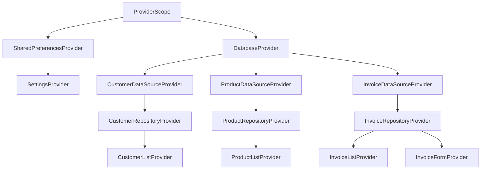

# Data Model: Riverpod State Management

## Provider Hierarchy

## Entities & State

### SettingsState
- **themeMode**: `ThemeMode` (light, dark, system)
- **locale**: `Locale` (en, ar)

### AsyncValue<T>
- Used for all repository-backed data.
- **States**: `Loading`, `Error(Object, StackTrace)`, `Data(T)`.

### InvoiceFormState
- **invoice**: `InvoiceModel` (the current draft)
- **isSaving**: `bool`
- **validationErrors**: `Map<String, String>`
- **items**: `List<InvoiceItemModel>`
